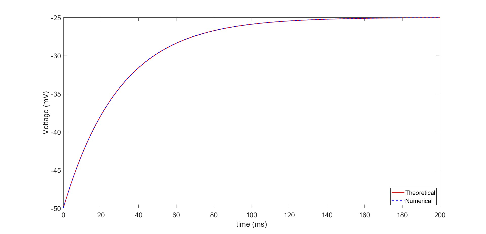
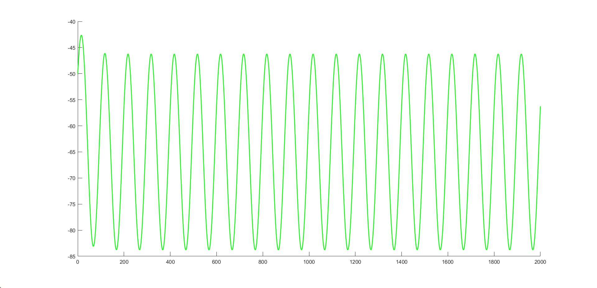

# Exercise 01 Report

## Title
First-Order Electrophysiological Membrane Model: Analytical and Numerical Simulation

## Executive Summary
This report presents the simulation of a first-order membrane voltage model using both an analytical solution and a forward Euler numerical method, followed by a sinusoidal current-input experiment. The numerical and theoretical step-response curves are in strong agreement, validating the Euler implementation at the selected time step. Under sinusoidal stimulation, the membrane voltage exhibits attenuated and phase-lagged oscillations, consistent with low-pass behavior of a first-order system.

## Model and Parameters
The membrane dynamics are modeled as:

\[
\frac{dV}{dt} = \frac{1}{\tau}\left(-V + E_0 + r\,i(t)\right)
\]

with the following parameters (from the provided script and exercise assets):

- Resting potential: \(E_0 = -65\) mV
- Membrane resistance: \(r = 10\) M\(\Omega\)
- Time constant: \(\tau = 30\) ms
- Initial voltage: \(V_0 = -50\) mV
- Numerical time step: \(\Delta t = 0.1\) ms

For the constant-current case, \(i = 4\) nA, giving:

\[
V_{\infty} = E_0 + r i = -65 + 10\cdot4 = -25\ \text{mV}
\]

and analytical response:

\[
V(t) = (V_0 - V_{\infty})e^{-t/\tau} + V_{\infty}
\]

## Methodology
1. Simulated the step-input case over 0-200 ms using both the analytical expression and Euler integration.
2. Compared the trajectories to assess numerical accuracy.
3. Simulated sinusoidal forcing with:
   - \(i(t) = 4\cos(2\pi f t)\) nA
   - \(f = 10\) Hz
   - duration: 0-2000 ms
4. Interpreted amplitude and transient behavior from the generated plots.

## Results

### 1. Step Input: Theoretical vs Numerical

The analytical (solid) and Euler (dashed) curves are nearly indistinguishable throughout the simulation window, indicating high numerical accuracy with \(\Delta t = 0.1\) ms. The voltage rises monotonically from \(-50\) mV toward the predicted steady-state \(-25\) mV, with expected first-order kinetics governed by \(\tau = 30\) ms.

### 2. Sinusoidal Input Response

Under 10 Hz sinusoidal current stimulation, the membrane voltage oscillates around the resting level with clear attenuation relative to the input-driven equilibrium term \(E_0 + r i(t)\). After a short transient, the response becomes periodic and stable, consistent with a linear first-order low-pass system.

Observed behavior from the plot is consistent with theory:

- Mean level near \(-65\) mV
- Peak-to-trough oscillation approximately from \(-84\) mV to \(-46\) mV
- Initial transient that decays over several time constants

## Discussion
The step-response agreement confirms that Euler integration is reliable for this model at the selected step size. The sinusoidal experiment demonstrates frequency-dependent filtering: the membrane does not fully track the fast-changing input equilibrium but instead shows reduced oscillation amplitude and delayed response. This behavior reflects the physiological interpretation of membrane capacitance and resistance acting as a smoothing filter on input current.

## Conclusion
The provided simulations successfully characterize a first-order membrane model in two regimes:

1. Accurate convergence of numerical Euler integration to the analytical step response.
2. Low-pass, attenuated, and phase-delayed voltage oscillations under sinusoidal forcing.

Overall, the results are internally consistent and aligned with expected first-order electrophysiological dynamics.
